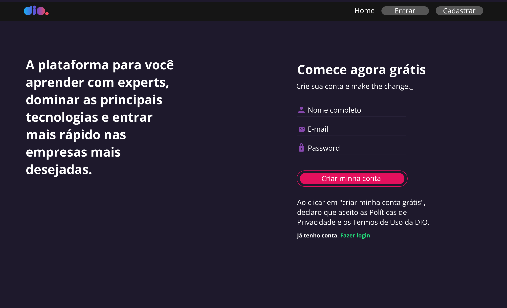
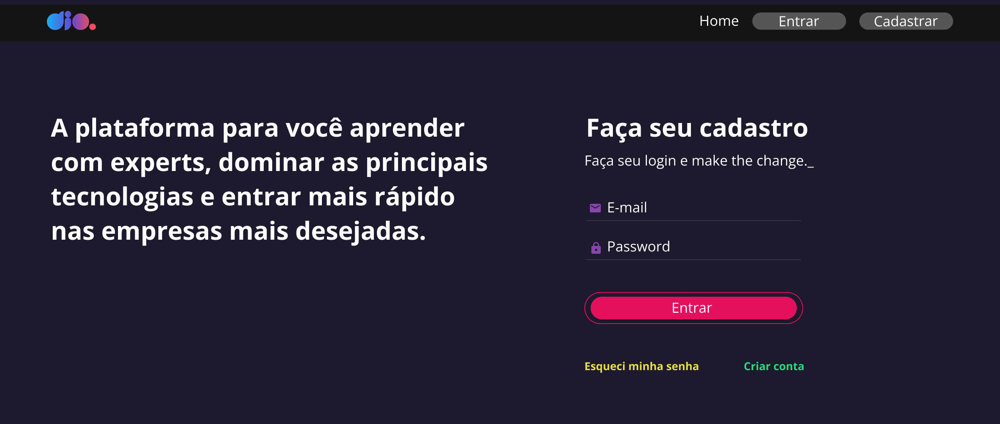
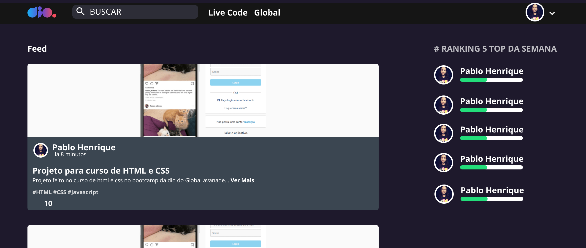

# Plataforma DIO
## Sobre
- Clonando a plataforma da DIO com React.js;
- Ir para [site oficial DIO](https://www.dio.me/).

## Tecnologias e Ferramentas utilizadas
- React.js;
- JavaScript;
- CSS;
- HTML;
- Figma.

## Figma
- Todo o layout deste projeto foi desenvolvido no Figma; 
- Verificar o projeto no [Figma](https://www.figma.com/file/fvjQQNtqaUdpuNixvCZVav/DIO-CLONE?node-id=0%3A1).

## Desafio
- Desafio 3 da Formação React Developer da DIO;
- Implementar a página de cadastro de novos usuários;

## Formação React Developer da DIO
- Ir para [Formação React Developer](https://www.dio.me/bootcamp/formacao-react-developer).
- Telas desenvolvidas em aula:

